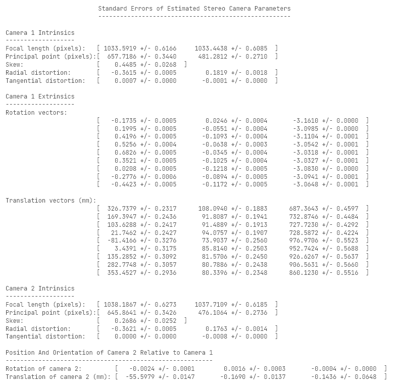
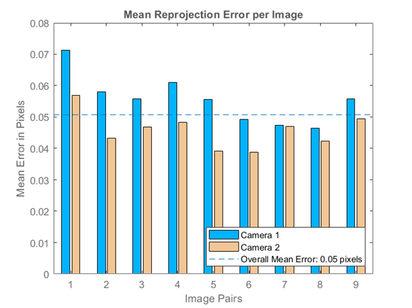
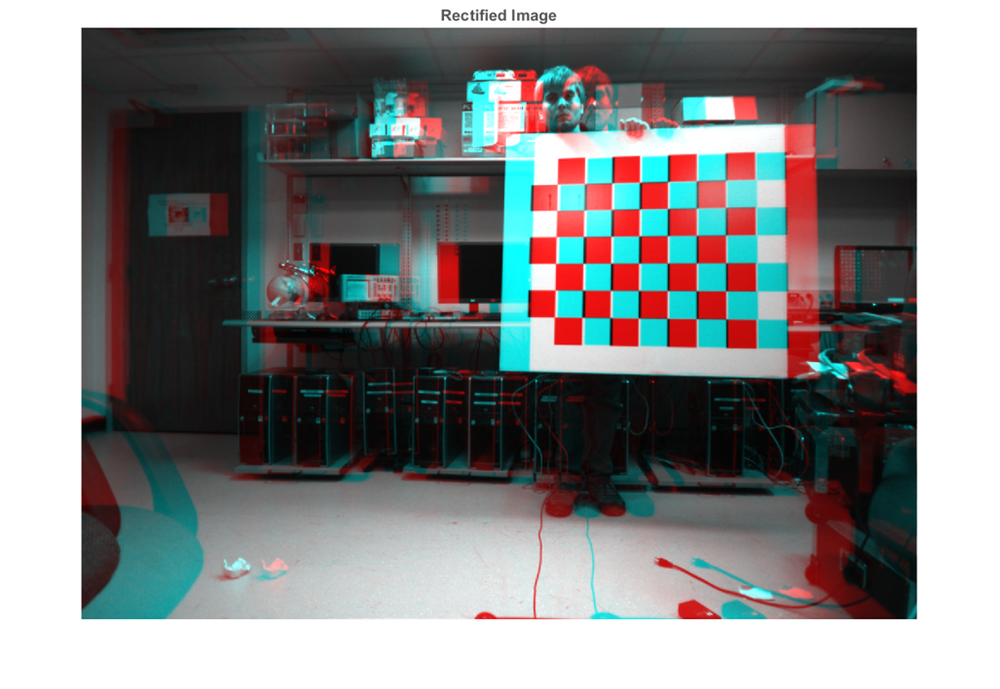
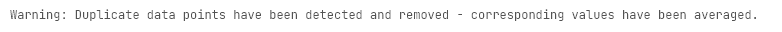

# `stereo2stl`

**Three-dimensional stereo reconstruction.**

Point cloud STL generation from stereo input.

Three implementations are available depending on your use case:
 - `script.m`: a command window script
 - `app.m`: a GUI script
 - `live.mlx`: a live script

### Dependencies

Install the [**`mpm`**](https://mathworks.com/matlabcentral/fileexchange/54548-mpm) addon to manage dependencies automatically.

Dependency tree:
 - [**`surf2stl`**](https://mathworks.com/matlabcentral/fileexchange/4512): Write STL file from surface data.

----

### Introduction
`stereo2stl` is a MATLAB generator script for stereo reconstruction.

Input: landscape, JPG/JPEG, grayscale stereo images.
 - Add checkerboard images from left stereo view to `./calibration/left`
 - Add checkerboard images from right stereo view to `./calibration/right`
 - Add modelling input images from stereo view to `./input`

```matlab
imformats() %  supported images formats in MATLAB
```

Output: `pointCloud` file in script location (STL format).
 - A 3D representation of the stereo image set.

----

### Image inputs
 - Images should be same orientation as checkerboard to reduce pixel
   error from reprojection.
 - For calibration images:
   - asymmetric (odd-even) checkerboard should be in all views
   - minimum image count per folder is 4 (for low reprojection error)
   - naming convention: `./calibration/<VIEW>/<VIEW>##.jpg`
    (e.g. `./calibration/left/left01.jpg`)
 - Image folders:
   - `./input`: actual 3D model target scene
   - `./calibration/left`: left stereo view w. checkerboard
   - `./calibration/right`: right stereo view w. checkerboard

Set up your image subfolders inside the same folder as `script.m`!

N.B: the image file names must be numbered in ascending order.

The script targets the left & right image in the `./input` folder and
converts it into a STL file.

----

## Source code

----

### Initialise generator script.

1. Cleanup of MATLAB workspace, IDE & output file.

```matlab
close all;
clear;
clc;
```

2. Show loading indicator.<br>
   Script takes T = ~30s to execute.

```matlab
loadingWaitbar = waitbar(0, 'Loading');
loadingWaitbar.Visible = 'on';
```

----

### Script variable configuration.

1. Load surf2stl if not installed.

```matlab
if ~exist('surf2stl', 'file')
    if ~matlab.addons.isAddonEnabled('mpm')
        error([                                                         ...
            'Please install MPM as a MATLAB Addon.\n'                   ...
            '<a href="'                                                 ...
            'https://uk.mathworks.com/matlabcentral/fileexchange/54548' ...
            '">'                                                        ...
            'mpm - File Exchange - MATLAB Central'                      ...
            '</a>'                                                      ...
        ])
    else
        mpm install surf2stl;
    end
end
```

2. User configuration variables.
   - `filePath`: path to current folder.
   - `stlPath`: name of point cloud STL.
   - `imageMinimum`: min. no of images in calib folder.
   - `squareWidthMm`: Checkerboard square width in mm.
   - `ptCloudDensity`: Point density within squareWidthMm.
   - `sGolayFiltOrder`: Savitsky-Golay extrapolation curve order.
   - `sGolayFiltFrameLen`: Savitsky-Golay sliding window point count.

```matlab
filePath = fileparts(mfilename('fullpath'));
stlPath = 'point-cloud.stl';
imageMinimum = 3;
squareWidthMm = 50;
ptCloudDensity = 5;
sGolayFiltOrder = 2;
sGolayFiltFrameLen = 9;
```

----

### Camera calibration of stereo images.

Code based on MATLAB `rectifyStereoImages` code sample. [\[1\]][mathworks-help-rectifystereoimages]

1. Delete STL if it exists.

```matlab
if exist(fullfile(filePath, stlPath), 'file')
   recycle on;
   delete(fullfile(filePath, stlPath));
end
```

2. Load all of our images in one go.<br>
   See ["Image inputs"](#image-inputs).
   - `inputImages`: Images from `./input` subfolder.
   - `calibLeftImages`: Images from `./calibration/left` subfolder.
   - `calibRightImages`: Images from `./calibration/right` subfolder.

```matlab
inputImages = imageDatastore(fullfile(filePath, 'input'));
calibLeftImages = imageDatastore(fullfile(filePath, 'calibration', 'left'));
calibRightImages = imageDatastore(fullfile(filePath, 'calibration', 'right'));
waitbar(0.1, loadingWaitbar);
```

3. Detect the checkerboards in the original files.

```matlab
[imagePoints, boardSize] = detectCheckerboardPoints(                    ...
    calibLeftImages.Files,                                              ...
    calibRightImages.Files                                              ...
);
waitbar(0.2, loadingWaitbar);
```

3. Calculate undistorted, real-world coordinates of checkerboard keypoints.

```matlab
worldPoints = generateCheckerboardPoints(boardSize, squareWidthMm);
```

4. Read input images into MATLAB, and convert to grayscale.<br>
   This reduces image data & overhead in calibration phase. [\[2\]][mathworks-help-rgb2gray]

```matlab
I1 = readimage(inputImages, 1);
if size(I1, 3) == 3
      I1 = rgb2gray(I1);
end
I2 = readimage(inputImages, 2);
if size(I2, 3) == 3
      I2 = rgb2gray(I2);
end
imageSize = [size(I1, 1), size(I1, 2)];
```

5. Image validation (for camera calibration).
   Throws error if:
   1. mismatch in image count between `./calibration/left` & `./calibration/right`.
   2. below 4 images in `./calibration/left` & `./calibration/right`.
   3. mismatch in resolution of `./input` images.

```matlab
imageSize2 = [size(I2, 1), size(I2, 2)];

imageAmounts = struct;
imageAmounts.L = size(calibLeftImages.Files, 1);
imageAmounts.R = size(calibRightImages.Files, 1);

if imageAmounts.L ~= imageAmounts.R      % error #1

    e = sprintf(                                                        ...
        'stereo2stl::ERR_MISMATCH_IMG_COUNT (L: %d, R: %d)',            ...
        imageAmounts.L, imageAmounts.R                                  ...
    );
    errordlg(e);
    error(e); %#ok<*SPERR>

elseif imageAmounts.L < imageMinimum    % error #2

    e = sprintf('stereo2stl::ERR_CALIB_IMG_INSUFFICIENT (%d)', imageAmounts.L);
    errordlg(e);
    error(e);

elseif ~isequal(imageSize, imageSize2)   % error #3

    e = sprintf(                                                        ...
        'stereo2stl::ERR_MISMATCH_IMG_DIM (L: %dx%dpx, R: %dx%dpx)',    ...
        imageSize(1), imageSize(2), imageSize2(1), imageSize2(2)        ...
    );
    errordlg(e);
    error(e);

end
```

6. Use MATLAB toolbox to calibrate the stereo camera system.
   - **Parameters:**
     - `EstimateSkew`: Are image axes exactly perpendicular? Default: `true`.
     - `EstimateTangentialDistortion` Factor in whether the camera is horizontal. Default: `true`.
     - `NumRadialDistortionCoefficients`: Good for fish-eye lenses. Default: `2`.
     - `ImageSize`: Matrix for size of image - `imageSize`.
   - **TODO:** Adjust `estimateCameraParameters` parameters for experimental stage.

```matlab
[stereoParams, ~, estimationErrors] = estimateCameraParameters(         ...
    imagePoints, worldPoints,                                           ...
    'EstimateSkew', true,                                               ...
    'EstimateTangentialDistortion', false                               ...
);
waitbar(0.3, loadingWaitbar);
```

> 

7. Display camera extrinisics for dissertation purposes.<br>
   Figure 1 & 2 - locations & reprojection errors.<br>
   Reprojection is process of "reprojecting" original image from a camera image.<br>
   Most camera images have distortion (e.g. "fisheye" lens effect).

```matlab
figure;
showExtrinsics(stereoParams, 'CameraCentric');
waitbar(0.4, loadingWaitbar);
figure;
showReprojectionErrors(stereoParams);
displayErrors(estimationErrors, stereoParams);
waitbar(0.5, loadingWaitbar);
```




8. Rectify the images using "valid" output view.<br>
   The "valid" option is most suitable for computing disparity. [\[3\]][mathworks-help-rectifystereoimages]<br>
   - **Parameters:**
     - `OutputView`: OutputView crops the image to a rectangle, fitting inside the overlapping, curved 3D anaglyph. Default: `valid`.

```matlab
[F1, F2] = rectifyStereoImages(I1, I2, stereoParams, 'OutputView', 'valid');
pixelDensityMm = mrdivide(                                              ...
    mean([                                                              ...
        stereoParams.CameraParameters1.FocalLength,                     ...
        stereoParams.CameraParameters2.FocalLength                      ...
    ], 2),                                                              ...
    mean([                                                            ...
        stereoParams.CameraParameters1.IntrinsicMatrix(1, 1),           ...
        stereoParams.CameraParameters2.IntrinsicMatrix(1, 1)            ...
    ], 2)                                                               ...
);
approxImageHeight = 2 * mean([size(F1, 1), size(F2, 1)], 2) / pixelDensityMm;
approxImageWidth = 2 * mean([size(F1, 2), size(F2, 2)], 2) / pixelDensityMm;
waitbar(0.6, loadingWaitbar);
```

9. Display an anaglyph image for "valid" output view.<br>
   Figure 3 - stereo anaglyph.

```matlab
figure;
imshow(stereoAnaglyph(F1, F2));
title 'Rectified Image';
waitbar(0.7, loadingWaitbar);
```



----

### Disparity computation from stereo images.

Code based on MATLAB `disparitySGM` code sample. [\[4\]][mathworks-help-disparitysgm]

1. Compute disparity map from stereo images (colormap of depth).

```matlab
disparityMap = disparitySGM(F1, F2, 'DisparityRange', [0, 64]);
waitbar(0.8, loadingWaitbar);
```

2. Display disparity map as jet colormap image.<br>
   Figure 4 - disparity map.

```matlab
figure;
imshow(disparityMap, [0, 64]);
colormap jet;
title 'Disparity Map';
colorbar;
waitbar(0.9, loadingWaitbar);
```


----

### Point cloud generation (using depth data).

1. Reconstruct the 3D image input into organised point cache matrix.<br>
   Produces raw point cloud of X-Y-Z data in m - standard STL dimensions.

```matlab
rawPoints3D = reconstructScene(disparityMap, stereoParams);
rawPoints3D(isinf(rawPoints3D)) = NaN;
rawPoints3D = double(rawPoints3D) ./ 1000;
```

2. Initialise axial, co-ordinate cache for point cloud.

```matlab
pointsCache = struct;
axesKeys = ['X', 'Y', 'Z'];
for m = 1:3
    k = char(axesKeys(m));
    p = rawPoints3D(:, :, m);
    pointsCache.(k) = p;
end
clearvars p k;
```

3. Compute checkerboard position as a point cloud.<br>
   It's the closest set of co-ordinates to the origin in the z-axis.<br>
   **TODO:** See if I need to change `min` in some way (assumes convex).

```matlab
checkerboardCentroid.Z = min(min(pointsCache.Z));
checkerboardIndex = sort(find(checkerboardCentroid.Z == pointsCache.Z));
checkerboardCentroid.X = mean(pointsCache.X(checkerboardIndex));
checkerboardCentroid.Y = mean(pointsCache.Y(checkerboardIndex));
```

4. Restrict point cloud to following conditions:
   - point cloud width/2 ~ image height
   - point cloud length = point cloud height = point cloud width

```matlab
limits = struct;
cacheAxes = char(fieldnames(pointsCache));

for m = 1:3
    switch m
        case 1
            bound = approxImageWidth / 2;
        case 2
            bound = approxImageHeight / 2;
        case 3
            bound = mean([approxImageHeight, approxImageWidth], 2) / 2;
        otherwise
            bound = mean([approxImageHeight, approxImageWidth], 2) / 2;
    end
    k = cacheAxes(m);
    lim = [                                                 ...
        checkerboardCentroid.(k) - bound/1000,              ...
        checkerboardCentroid.(k) + bound/1000               ...
    ];
    limits.(k) = lim;

    p = pointsCache.(k);
    p(p < lim(1) | p > lim(2)) = NaN;
    pointsCache.(k) = p;
end

clearvars k lim p;
```

5. Remove invalid (NaN) values inside point cloud.
   - Values that are +/- `+Inf`/`-Inf`/`NaN`.
   - Points that fall outside range of point cloud.

```matlab
nanPoints = ( 0                                                         ...
    | isnan(pointsCache.X)                                              ...
    | isnan(pointsCache.Y)                                              ...
    | isnan(pointsCache.Z)                                              ...
);

for m = 1:3
    k = cacheAxes(m);
    p = pointsCache.(k);
    p(nanPoints) = checkerboardCentroid.(k);
    pointsCache.(k) = p;
end

clearvars k p;
```

6. Surface mesh denoising and interpolation.<br>
   **See:** https://commons.wikimedia.org/wiki/File:Lissage_sg3_anim.gif
   1. The `scatteredInterpolant` factory function computes interpolant. [\[5\]][mathworks-help-scatteredinterpolant]
   2. MATLAB maps `meshgrid` regular matrix of points for X and Y.
   3. Savitzky-Golay filter used to denoise points in Z axis.<br>
      Code adapted from StackOverflow. [\[6\]][stackoverflow-interpolate-savitskygolay]

```matlab
gs = (1 / ptCloudDensity) * (squareWidthMm / 1000);

I = scatteredInterpolant(pointsCache.X(:), pointsCache.Y(:), pointsCache.Z(:), 'natural');

gridPoints = struct;
intX = min(pointsCache.X(:)):gs:max(pointsCache.X(:));
intY = min(pointsCache.Y(:)):gs:max(pointsCache.Y(:));
[gridPoints.X, gridPoints.Y] = meshgrid(intX, intY);

gridPoints.Z = I(gridPoints.X, gridPoints.Y);
intZ1 = sgolayfilt(gridPoints.Z.', sGolayFiltOrder, sGolayFiltFrameLen);
intZ2 = sgolayfilt(gridPoints.Z, sGolayFiltOrder, sGolayFiltFrameLen);
gridPoints.Z = (intZ1.' + intZ2)/2;

points3D = double.empty();
for m = 1:3
    points3D(:, :, m) = gridPoints.(cacheAxes(m));
end

clearvars cacheAxes;
```

> 

7. Convert 3D points to point cloud.

```matlab
ptCloud = pointCloud(points3D);
```

8. Launch rotatable, 3D point cloud viewer.<br>
   Figure 5 - scattered point cloud.

```matlab
figure;
figure3D = pcshow(                                                      ...
    ptCloud,                                                            ...
    'VerticalAxis', 'y',                                                ...
    'VerticalAxisDir', 'Down',                                          ...
    'MarkerSize', 12                                                    ...
);
title '\color{black} Point Cloud';
movegui(figure3D, 'center');
figure3D.OuterPosition = [0 0 1 1];

xlabel 'x (horizontal displacement in m)';
ylabel 'y (vertical displacement in m)';
zlabel 'z (point depth in m)';

view(0, -90);
set(gcf, 'Color', 'w');
set(gca, 'XColor', 'k');
set(gca, 'YColor', 'k');
set(gca, 'ZColor', 'k');

colormap(flipud(jet));
caxis(zlim(figure3D));
colorbar(figure3D);
rotate3d on;

waitbar(1, loadingWaitbar);
close(loadingWaitbar);
```


----

### STL file generation from point cloud.

Using `surf2stl` for high stability & speed (low interpolation).
```matlab
stlPath = char(fullfile(filePath, stlPath));
surf2stl(stlPath, gridPoints.X, gridPoints.Y, gridPoints.Z);
```
> 
```matlab
winopen(stlPath);
```

> 

----

### References.

 1. https://www.mathworks.com/help/matlab/ref/rgb2gray.html
 2. https://www.mathworks.com/help/vision/examples/depth-estimation-from-stereo-video.html
 3. https://www.mathworks.com/help/vision/ref/rectifystereoimages.html
 4. https://www.mathworks.com/help/vision/ref/disparitysgm.html
 5. https://www.mathworks.com/help/matlab/ref/scatteredinterpolant.html
 6. https://stackoverflow.com/a/39576639

<!-- Links -->
[mathworks-help-rgb2gray]: https://www.mathworks.com/help/matlab/ref/rgb2gray.html
[mathworks-help-depthestimation]: https://www.mathworks.com/help/vision/examples/depth-estimation-from-stereo-video.html
[mathworks-help-rectifystereoimages]: https://www.mathworks.com/help/vision/ref/rectifystereoimages.html
[mathworks-help-disparitysgm]: https://www.mathworks.com/help/vision/ref/disparitysgm.html
[mathworks-help-scatteredinterpolant]: https://www.mathworks.com/help/matlab/ref/scatteredinterpolant.html
[stackoverflow-interpolate-savitskygolay]: https://stackoverflow.com/a/39576639
